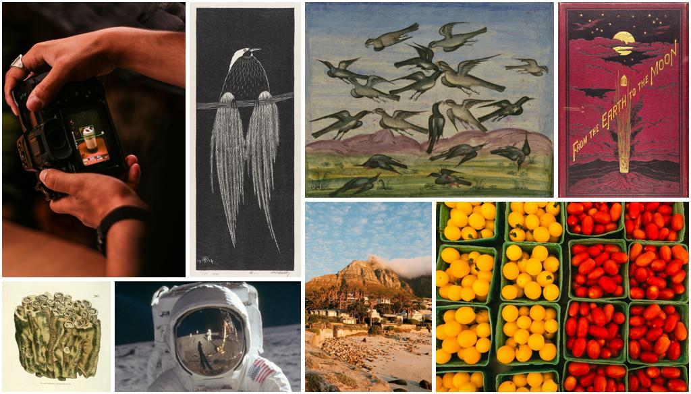

# Blocked Recursive Image Composition

`collage` is a Python library for generating automatic photo layouts on arbitrary rectangular canvases, based on the Blocked Recursive Image Composition [algorithm](https://dl.acm.org/action/downloadSupplement?doi=10.1145%2F1459359.1459496&file=p821-atkins.pdf) by C. Brian Atkins. Unlike template-based approaches, BRIC dynamically arranges any number of photos while strictly preserving aspect ratios and specified spacing (gutters and borders). The layout process recursively partitions the canvas using a binary tree structure and computes precise photo placements without cropping or overlap. BRIC is ideal for applications such as collages, photobooks, slideshows, and generative design tools.

## Example
Below is an example that illustrates the kind of layout BRIC generates automatically. Without using any predefined templates, BRIC arranges a variety of images into a cohesive composition. The aspect ratios of the original images are preserved, gutters and borders are applied uniformly, and the available canvas space is used effectively. The result is a clean, visually balanced layout that would be time-consuming to design by hand.



## Getting Started


### 1. Install the library
`collage` isn’t on PyPI yet, so install it directly from GitHub:

```bash
pip install "git+https://github.com/stefanwayon/collage.git"
```

### 2. Generate a collage using the CLI
The repository includes a command-line interface that handles layout and rendering for you:

```bash
python -m collage \
    --border 10 \          # white frame around each picture (in pixels)
    --spacing 8 \          # gap between neighbouring pictures (in pixels)
    --output_width 1024 \  # width of the final canvas
    --output my_collage.png \
    photo1.jpg photo2.jpg photo3.jpg
```

This command resizes the input images, computes a BRIC layout, and saves the result to `my_collage.png`.

### 3. Use the library in your own code
For more control over the canvas or to add annotations, use the core function directly:

```python
from collage.bric import fit_pictures_balanced
from PIL import Image

# Load your images
imgs = [Image.open(p) for p in ["photo1.jpg", "photo2.jpg", "photo3.jpg"]]

# Compute layout
sizes, positions, canvas_size = fit_pictures_balanced(
    [img.size for img in imgs],
    width=1024,
    border=10,
    spacing=8,
    round_result=True  # use Mixed Integer Programming to compute pixel-perfect image sizes
)

# Create the canvas and paste images
canvas = Image.new("RGB", (round(canvas_size.w), round(canvas_size.h)), "white")
for img, new_sz, pos in zip(imgs, sizes, positions):
    canvas.paste(img.resize((round(new_sz.w), round(new_sz.h))), (round(pos.x), round(pos.y)))

canvas.save("my_collage.png")
```

The `fit_pictures_balanced` function selects a layout using BRIC, preserving each image's aspect ratio and spacing, and returns exact pixel positions and sizes.
